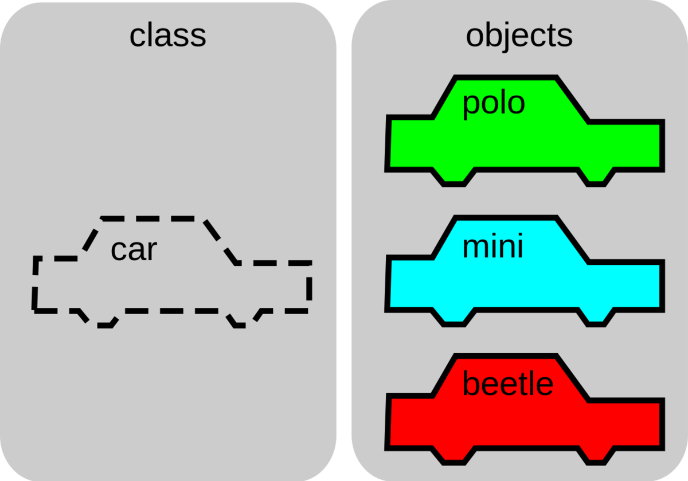

# Python Classes

## What is a class?


Python is an object oriented programming language.
Almost everything in Python is an object, with its properties and methods.

Classes provide a means of bundling data and functionality together. Creating a new class creates a new type of object, allowing new instances of that type to be made. Each class instance can have attributes attached to it for maintaining its state. Class instances can also have methods (defined by its class) for modifying its state.



A Class is like an object constructor, or a "blueprint" for creating objects.

## Class Objects

```python
# `class` identifier tells python that the following is a class definition
class Car:
    """ A Class is like an object constructor, or a "blueprint" for creating objects.
    Classes provide a means of bundling data and functionality together. 

    Creating a new class creates a new type of object, allowing new instances of that type to be made. 

    Each class instance can have attributes attached to it for maintaining its state. 
    Class instances can also have methods (defined by its class) for modifying its state.
    """

    # class variable shared by all instances
    wheels = 4

    def __init__(self, kind=""):
        # instance variable unique to each instance
        self.doors = 4
        self.kind = kind
        self.speed = 0

    def honk(self):
        """Press the horn of the object """
        print('honk honk')

    def accelerate(self, new_speed):
        """Accelerates the car to a particular speed value"""
        self.speed = new_speed

polo = Car('polo')
print(f'The car is a {polo.kind}')
print(f'The car has {polo.doors} doors')
print(f'The car has {polo.wheels} wheels')
polo.honk()
print(f'The car is driving {polo.speed}')
polo.accelerate()
print(f'The car is driving {polo.speed}')
```

## Inheritance

*Inheritance* allows us to define a class that inherits all the methods and properties from another class.

- **Parent class** is the class being inherited from, also called *base class*.
- **Child class** is the class that inherits from another class, also called *derived class*.

```python

class Vehicle:
    def __init__(self, wheels):
        self.wheels = wheels

    def honk(self):
        print("honk honk")


class Car(Vehicle):
    def __init__(self, wheels, kind):
         super().__init__(wheels)
         self.kind = kind

    def honk(self):
        print("Beep Beep")

class Bike(Vehicle):
    def __init__(self, wheels):
         super().__init__(wheels)

    def honk(self):
        print("Kling Kling")


car = Car(4, 'mini')
print(car.wheels)
print(car.kind)
car.honk()
```

## Exercises

### Classes

1. Create a new class that represents a *person* 
2. The person should have fields for a **First Name**, **Last Name** and an **Age** (the age should be a positive number, with a default of 0 assuming a new born)
3. The person should be able to speak and when greeted (`greet()`) should be able to respond with `Hello my name is <first name> <last name> and I am <age> years old` with the combined name of the persons instance
4. Ther person should also be able to age, when the birthday (`birthday()`) is happening, the age should increase by `1`
5. Bonus: Think about other valuable properties that a person could consist of.

### Inheritance

1. Create a zoo of different animals
1. Animals should be of different species, the zoo should consist of **Fish**, **Reptiles**,  **Birds**, and **Mammals**
1. Each animal can be identified by a **family**
1. The zoo gives every animal a new name
1. Each animal can make a specifc sound (`sound()`)
1. Bonus: Think about other things to add to the Zoo. Maybe the Zoo has special Mammals, like me and you?