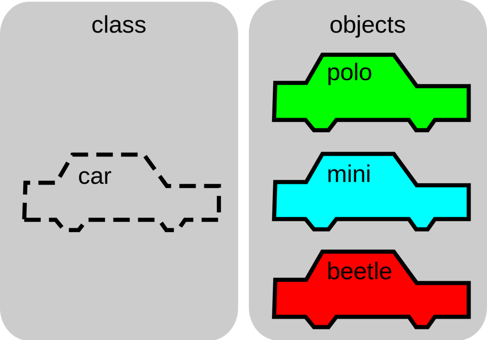

# Python Classes

- [Python Classes](#python-classes)
  - [What is a class?](#what-is-a-class)
  - [Class Definition Syntax](#class-definition-syntax)
  - [Class Objects](#class-objects)
  - [Instance Objects](#instance-objects)
  - [Method Objects](#method-objects)
  - [Special Class methods](#special-class-methods)
  - [Class and Instance Variables](#class-and-instance-variables)
  - [Inheritance](#inheritance)

## What is a class?



## Class Definition Syntax

```python
class ClassName:
    <statement-1>
    .
    .
    .
    <statement-N>

```

## Class Objects

```python
# `class` identifier tells python that the following is a class definition
class Car:
    # class variable shared by all instances
    wheels = 4

    def __init__(self, kind = ""):
        # instance variable unique to each instance
        self.doors = 4
        self.kind = kind

    def honk(self):
        return 'honk honk'

x = Car()
```

## Instance Objects

```python
class Car:
    # class variable shared by all instances
    wheels = 4


x = Car()
x.wheels
```

## Method Objects

```python
class Car:

    def honk(self):
        print('honk honk')

x = Car()
x.honk()
```

## Special Class methods

```python
class Car:
    def __init__(self):
        self.doors = 4

x = Car()
```

## Class and Instance Variables

```python
# `class` identifier tells python that the following is a class definition
class Car:
    # class variable shared by all instances
    wheels = 4

    def __init__(self, kind = ""):
        # instance variable unique to each instance
        self.doors = 4
        self.kind = kind

    def honk(self):
        return 'honk honk'


polo = Car('Polo')
mini = Car('Mini')
beetle = Car('Beetle')

print(f'The car is a {polo.kind}')
print(f'The car has {polo.doors} doors')
print(f'The car has {polo.wheels} wheels')
polo.honk()
```

## Inheritance
