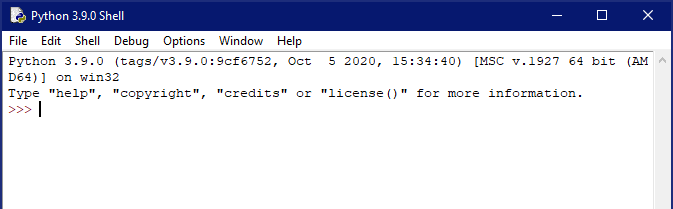
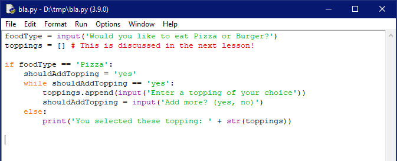
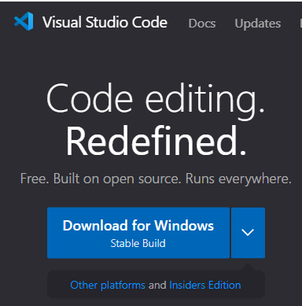
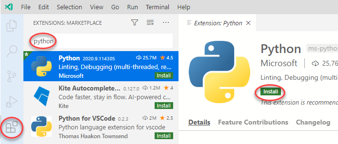
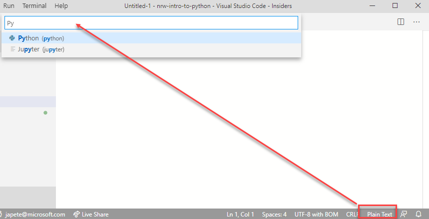
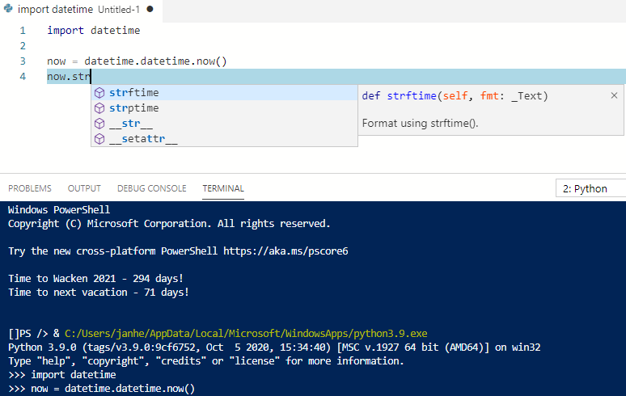
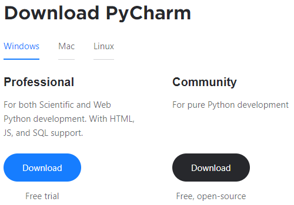
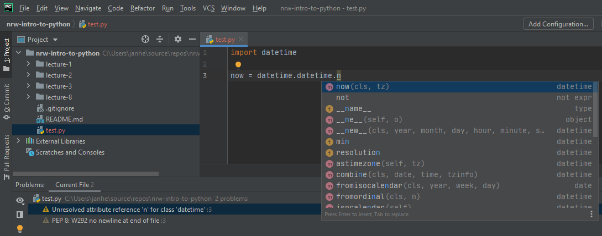

## Editors

There is an abundance of different editors available to work with Python. During the first two lessons you already saw some of them being used. Today, we'll go into a bit more detail and examine **IDLE**, the built-in editor, **Visual Studio Code**, and **PyCharm**. While we are working with Jupyter Notebooks, which are quite popular in data sciences, they are not always easy to work with. And of course you would not develop an actual program within a notebook.

Other popular editors are `Eclipse with PyDev` and `Spyder`, but see for your self.

### IDLE

The acronym IDLE stands for `Integrated Development and Learning Environment`, although some believe it was named after Eric Idle of Monty Python fame. IDLE is developed entirely in Python, so there really is no need to install any additional components.

As far as the editing experience goes, IDLE is really bare-bones and only contains the minimum needed to start coding. Compared to the other development environments it leaves a lot to be desired. However, it is easily accessible and does not require any setup to be done.  
  

The first start of IDLE places you in the interactive Python shell - you can start running commands and scripts immediately. By pressing Control+N (Apple: Command+N) you can open a new editor window. In the editor window you would develop longer pieces of code like libraries or complex tools.  
  
IDLE also includes a debugger. Debuggers let you examine the runtime environment during code execution. We will see this in a much later lesson, since debugging is something slightly more advanced. While tools like PyCharm and Code are easier to use while debugging, IDLE is good enough.

In addition to a debugger you also get what is called Calltips (other IDEs call this code completion, IntelliSense, ...) - interactive tips how to use a given method, including the first line of the docstring of this method.

### Visual Studio Code

Visual Studio Code is an open source, cross-platform editor based on the Electron framework developed by Microsoft and the open source community. Being open source like Python, you could compile it from source, or use one of the many installation packages for your platform.  
  
Upon the first start of VS Code, you cannot do anything with Python - yet. VS Code is extensible through downloading extensions for the languages you would like to develop in. So in addition to Python and VS Code you would also need to enable the Python extension.  
  
To use the editor with Python, either create an empty file and select the language mode `Python` or simply open any file with the `py` or `ipynb` extension. This automatically starts the Python extension and even a terminal running Python if you want. The extension can be tweaked and configured to your liking, with over 160 individual settings. The defaults are usually adequate, but especially when collaborating with peers you could setup the extension for all your project members, as these settings can be included alongside your code.  
  
Development can now be done in the scripting pane which can be moved and docked at a position you are comfortable with. The editing experience includes automatic code completion with IntelliSense. Through contextual pop-ups you can discover interactively how methods can be used, which properties an object contains and so on. Running single lines of code in the terminal the key combination `Shift+Enter` can be used. This helps you execute your code line by line, for example during a lengthy debug session.  
 

### PyCharm

PyCharm is a popular open-source editor by JetBrains, a leader in development tools. Like all of their tooling it is nicely polished, super customizable, extensible and free for individual developers. Installation packages are available for different platforms.  
  
The code environment itself is geared towards developers, with code lense and code completion, debugging tools and its modularity. One of the greatest feature about PyCharm is its refactoring capabilities. 

Refactoring is something that will come up at some point in the life of a developer. Your code base has grown, bits and pieces are copied and pasted rather than extracted into a function. The levels of nesting are getting deeper. The module has grown too large purely in lines of code. 

All of this can be remedied with clever refactoring. PyCharm can help extract code into a method and replace all references to it by the newly created method for example.  
  
Moreover, PyCharm contains a linter like VS Code and is capable of displaying syntax errors as well as PEP violations. In the previous screenshot for example, the last line of code should be a blank line. PyCharm of course also boasts an internal console to test pieces of code, access to source code management systems and much more. Support for Jupyter notebooks however is only available in the non-free editions.