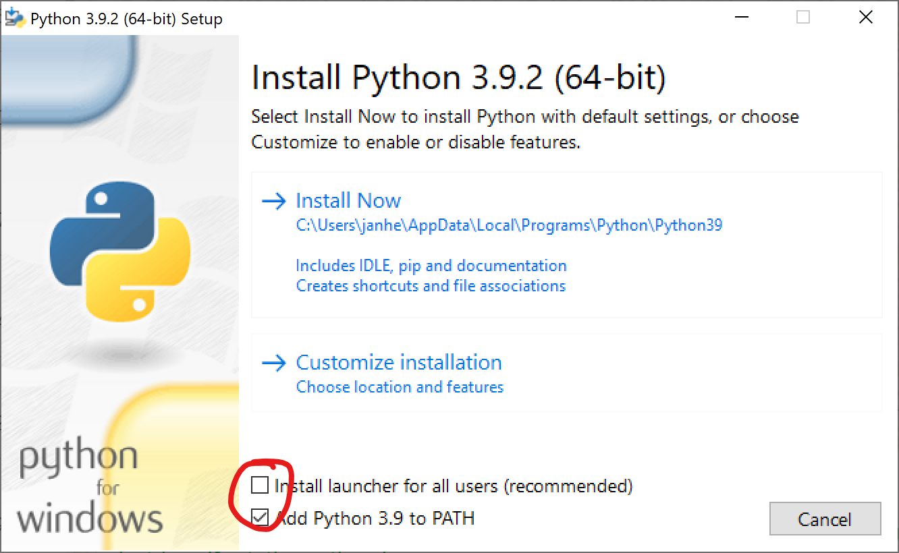
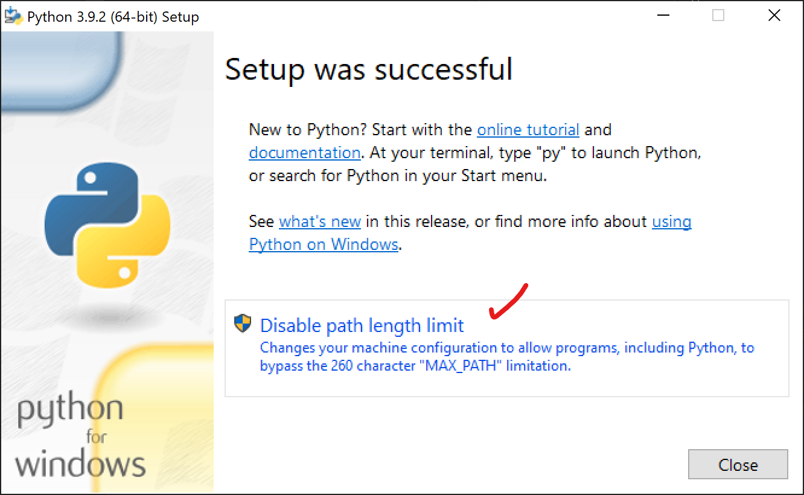
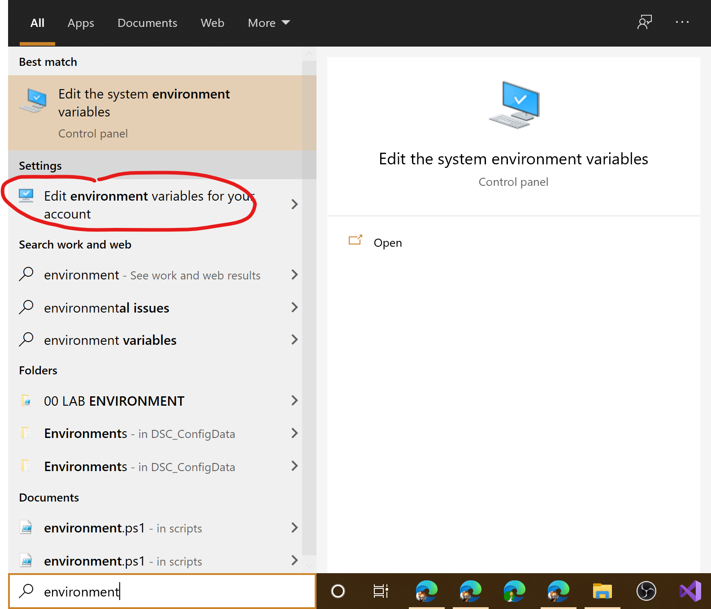

# Installing Python

Already installed? Then go right ahead to [editors](editors.md)

## Windows

### Locations

Windows has different default locations for software installations.
- `C:\Program Files` : System-wide installation, requires administrative privileges  
- `C:\Users\<USERNAME>\AppData\Local` : Per-user installation, does not require special   privileges
- `C:\ProgramData` : System-wide storage for configuration settings, requires administrative privileges

### System-wide or per user?

Installing Python system-wide requires *administrative privileges*, and is not ideal in
some scenarios.

1. Download Python from (https://www.python.org/downloads/windows/)
1. Start the downloaded file (e.g. by double-clicking it)
1. Walk through the installer
1. Don't forget to check the box to add Python to the PATH
1. Disabling the system-wide check box will only install Python for your own account


[]
[]

After the installation is finished, Python can be found in `C:\Users\<USERNAME>\AppData\Local`. To
start Python, simply press the Windows key or click in the search bar at the
bottom of the screen and type `python`. It should already be listed and available.

After starting Python, you will be greeted by an interactive command prompt. This
is your REPL, or read evaluate print loop.

Try starting off with a first command, help. Notice the output of the command.

### Adding Python to PATH

On Windows, executables can be added to an environment variable called PATH. All
file system paths inside this variable are searched for executables, so that you
can simply type the name of the file, e.g python, to start it.

To do so, locate Windows PowerShell in your program menu and open it. Paste the
following lines of code into the terminal and execute them:
```powershell
$currentValue = [Environment]::GetEnvironmentVariable('PATH', 'User')
$newValue = -join @($currentValue, ';', (Join-Path $env:LOCALAPPDATA 'Programs\Python\Python39'))
[Environment]::SetEnvironmentVariable('PATH', $newValue, 'User')
```

Alternatively, type in `Environment` in the Windows start menu and open the app.
[]

When the app is open, double-click PATH and simply add the path, for example: `C:\Users\janhe\AppData\Local\Programs\Python\Python39`.
[]

### Windows Store

The Windows Store also contains Python, which can be installed without a Microsoft account. Simply search for
it in the store.

### Windows Subsystem for Linux

The Windows Subsystem for Linux is a Windows feature that can be enabled which allows you
to run a Linux command line directly on Windows. Check out [this guide](https://docs.microsoft.com/en-us/learn/modules/get-started-with-windows-subsystem-for-linux/)
for more information.

## Linux

On Linux, the installation process is pretty straigh-forward. Moreover, most distributions
like Ubuntu, Fedora or openSuSE already contain Python.

To install Python in case it is not yet installed, use the package management tool of your distribution.

| OS | Command | Installation command |
--- | --- | ---
Ubuntu/Debian/Mint/... | apt | sudo apt install python3.9
Fedora, new CentOS/RHEL | dnf | sudo apt install python3.9
Older CentOS/RHEL | yum | sudo yum install python3.9
openSuSE | zypper | sudo zypper install python3.9
Arch | pacman | sudo pacman -i python3.9

### Locations

Linux also has different default locations for executables, configuration
data and the like.

- `/usr/bin` - primary source of commands  
- `/bin` - source of commands in single user mode, symlinked
- `/etc` - system configuration files, program configurations, ...
- `/home` - user home location, one subdirectory per user

Now that you have successfully installed Python, go to [editors](editors.md) and
see if one of those editors fits your needs. Or better yet: Try out multiple editors
and find the one you like most.