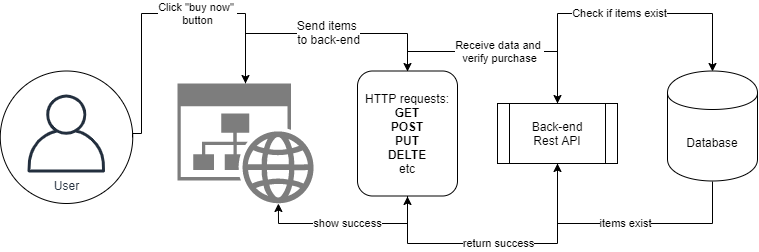

# What are RESTful APIs?
'[...] architectural style for an application program interface (API) that uses HTTP requests to access and use data'  
(https://searchapparchitecture.techtarget.com/definition/RESTful-API)  

It allows a standadized communication between the user, front-end and the databases:  


You can as well manage the following important tasks:
- Access control
- Middleware (e.g. IP logging, exception handling, etc.)
- User sessions
- Data processing


So it is a way to send and receive data most often in form of json (you can compare this to a Python dictionary):  
JSON
```
{
    "tpye": "info",
    "msg": "You look good!",
    "items": [1, 2, 3, 4]
}
```

To get or send data you need to select the correct method...

## Methods
### GET
Do a request to the API to get info out of it
### POST
Do a request to the API to send data to the server
### DELETE
Do a request to the API to delete info from the server

### Other
PATCH, OPTIONS, PUT

## HTTP Status Codes
### 200
All good your request resulted in a successful response
### 404

### 403
You are not authorized to do this request --> maybe wrong credentials
### And many many more
--> https://en.wikipedia.org/wiki/List_of_HTTP_status_codes


# Python Frameworks
(https://rapidapi.com/blog/best-python-api-frameworks/)

- Flask (https://palletsprojects.com/p/flask/) --> Most popular
- Django (https://www.djangoproject.com/) --> Full stack web framework (it can do everything)
- FastAPI (https://fastapi.tiangolo.com/) --> New and very fast (async)
- Sanic (https://sanicframework.org/en/) --> Lightweight
- Falcon (https://falcon.readthedocs.io/en/stable/) --> Large applications and class-based

# Some example API documentations you can check
- https://developer.twitter.com/en/docs/twitter-api
- https://developers.google.com/maps/documentation/places/web-service/search?hl=de
- https://developers.facebook.com/docs/instagram/oembed


