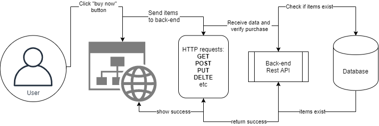

# What are RESTful APIs?
REST APIs are an
> '[...] architectural style for an application program interface (API) that uses HTTP requests to access and use data'  

(Quote from [https://searchapparchitecture.techtarget.com/](https://searchapparchitecture.techtarget.com/definition/RESTful-API))

REST is an abbreviation for **RE**presentational **S**tate **T**ransfer.

REST APIs allow a standadized communication between a user (might be a human sitting in front of a computer or a machine), and another machine:  


Beyond online shopping, REST APIs are used e.g. for:
- Access control
- Middleware (e.g. IP logging, exception handling, etc.)
- User sessions
- Data processing
## Resources
A basic idea of RESTful APIs is that of *Resources*. The concept was initially developed to represent documents in the World Wide Web through URLs (Uniform Resource Locator).

In the context of REST, the concept is extended to be...
> [...] an object with a type, associated data, relationships to other resources, and a set of methods that operate on it. It is similar to an object instance in an object-oriented programming language.

(Quote from [https://restful-api-design.readthedocs.io/](https://restful-api-design.readthedocs.io/en/latest/resources.html))

They are addressed through their URIs (**U**niform **R**esource **I**dentifier).

If you were to provide an API to interact with the items in your room, it may provide resources like:
* http://myroomapi.com/bed
* http://myroomapi.com/chair

## Methods
HTTP provides a couple of basic types of actions you might be able to perform on a resource. Since they instruct the server what to do, they are also sometimes called "HTTP Verbs".
### GET
Receive information about the resource
### POST
Create a new resource
### DELETE
Delete a resource
### Other
PATCH, OPTIONS, PUT

Following in the example above, your API could provide the user the option to:
* Get information on your items: e.g. GET Request to http://myroomapi.com/bed
* Remove items from your room: e.g. DELETE Request to http://myroomapi.com/chair
* Put new items in your room: e.g. POST Request to http://myroomapi.com/table
* ...

## Data Exchange in REST APIs

It is possible to exchange data through REST APIs. Data may come implicit in the URI (c.f. the resource identifying a Lion), or it may be attached the request as payload (called the "Body" of the request). In these cases, nowadays, the data is usually transfered as a *JSON* document.

JSON is short for "**J**ava**S**cript **O**bject **N**otation" which makes clear that is was inspired by the way data is stored in JavaScript. However, it will look immeditaly familiar to you, if you recall the lectures on lists and dictionaries in Python.

Here is an example of a JSON "object":

```json
{
    "type": "info",
    "msg": "You look good!",
    "items": [1, 2, 3, 4]
}
```

## HTTP Status Codes
Status codes are a concise, machine-readable way for the API server to communicate the result of your request. You can find [a list of all HTTP status codes on Wikipedia](https://en.wikipedia.org/wiki/List_of_HTTP_status_codes).

All status codes are three-digit numbers. If you have a look at the first digit, you already know roughly what has happened:
### 2xx Status Codes: All good!
All good your request resulted in a successful response
* If you read this in your browser, there was a 200 status code communicated at some point!
### 3xx Status Codes: Redirect.
The user has to take additional actions.

### 4xx Status Codes: Client Errors
The client did something wrong.
* You have probably seen the "404" error before, indicating that you tried to access a resource that does not exist.

### 5xx Status Codes: Server Errors
The server encountered a problem while responding to an (otherwise valid) request.


# Python Frameworks
REST APIs are provided by web-servers just like (and often in combination with) the websites that humans visit on the web. However, the communication is meant to enable automated exchange of concise information, not provide visually appealing websites.

That's why there is a large overlap between Python frameworks to build web-servers and libraries to provide REST APIs. Today, all major web frameworks in Python provide (more or less and sometimes through additional libraries) support to build REST APIs.

Here is a list (courtesy of [rapidapi.com/blog/](https://rapidapi.com/blog/best-python-api-frameworks/)):

- Flask (https://palletsprojects.com/p/flask/) --> Most popular
- Django (https://www.djangoproject.com/) --> Full stack web framework (it can do everything)
- FastAPI (https://fastapi.tiangolo.com/) --> New and very fast and quickly gaining popularity. Our choice!
- Sanic (https://sanicframework.org/en/) --> Lightweight
- Falcon (https://falcon.readthedocs.io/en/stable/) --> Large applications and class-based

# Some example API documentations you can check
- https://developer.twitter.com/en/docs/twitter-api
- https://developers.google.com/maps/documentation/places/web-service/search?hl=de
- https://developers.facebook.com/docs/instagram/oembed


