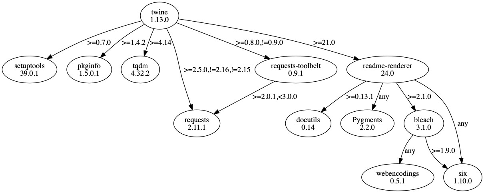

= Lecture 17 - Dependency Management 101

== Recap: Modules, Packages, `pip` & PyPI

* A module is a text file with the file extension `.py` that contains code, which can be included and used with the `import` statement.
* A package is a directory containing a `$$__$$init$$__$$.py` file as well as modules and sub-directories. It can be used to organize modules hierarchically.
* The Python Package Index (PyPi) is a vast collection of packages that can be installed using the `pip` package installer.

== Dependency management

* Dependencies: packages required by your Python project (e.g., `fastapi` for a website or `pandas` for data analytics)
* What's the big deal with dependency management? Why not just `pip install` whatever you need and move on?
** Packages can have major changes between versions. E.g. functionality is added or removed. APIs can change, making your code incompatible with an older or newer version of a package. -> You need to specify the version of a package to make sure the code runs.
** Different projects you are working on might need different versions of the same package. -> You need separate **environments** for the different projects.
** You might collaborate on a project with other people. -> They need to know which packages in which versions are required to run the code.
** You might want to run your code on a different machine than your personal computer (e.g. a server for a website). -> You need to know which packages in which versions to install on the machine so it can run the code.
* What is dependency management?
** Manage separate environments
** Make sure each environment contains the right set of packages in the right versions for the Python project to run
** Make the environment definition (set of packages with versions) easily sharable -> text file

== Tools for Python Dependency Management

* The Python community takes the evolutionary approach to many things. -> Different solutions can coexist. The strongest solutions prevail.
* There are many tools for dependency management, each with their pros and cons
** `pip` (`requirements.txt`)
** `conda` (`environment.yml`)
** `poetry` (`pyproject.toml`)
* This lecture will be done with `pip` because it is the default / builtin package installer for Python, but the principles carry over to the other ones.

== Walkthrough

The following shows how to create a project with proper dependency management step-by-step.

Run the parts AFTER the ">".

. Create project directory and enter it
+
....
//  Windows (PowerShell)

> md my_project
> cd .\my_project\
....
+
....
// macOS + Linux (zsh / bash)

> mkdir my_project
> cd my_project
....
. Create virtual environment
+
This will create a directory with the name `.venv` inside the project directory. While `.venv` is the conventionally used name, you can name the directory however you want.
+
....
//  Windows (PowerShell), macOS + Linux (zsh / bash)

> python -m venv .venv
....
. Activate virtual environment
+
....
//  Windows (PowerShell)

> .venv\Scripts\activate
....
+
....
// macOS + Linux (zsh / bash)

> . .venv/bin/activate
....
+
After activating the environment, running `python` runs the Python inside the activated virtual environment. You can check, which Python executable you are running as follows
+
....
//  Windows (PowerShell)

> Get-Command python | Format-Table -AutoSize
....
+
....
// macOS + Linux (zsh / bash)

> which python
....
+
When you are done working on the project, you can deactivate the virtual environment by running
+
....
//  Windows (PowerShell), macOS + Linux (zsh / bash)

> deactivate
....
. Upgrade `pip` to a version greater than 20.3 to get the new dependency resolver
+
....
//  Windows (PowerShell), macOS + Linux (zsh / bash)

> python -m pip install --upgrade pip
....
. Create a file called `requirements.txt` in the project directory containing the following
+
....
twine>=3.4.1
pipdeptree>=2.0.0
....
. Install project dependencies (re-run every time you changed `requirements.txt`)
+
....
//  Windows (PowerShell), macOS + Linux (zsh / bash)

> python -m pip install -r requirements.txt
....
. Freeze dependencies for reproducibility
+
....
//  Windows (PowerShell), macOS + Linux (zsh / bash)

> python -m pip freeze > requirements.freeze.txt
....
. To add, remove or change a project dependency, change `requirements.txt` and re-run steps 6 and 7

== Further Considerations

* The direct project dependencies often have dependencies themselves. You can check the dependency tree with a tool like `pipdeptree` (https://pypi.org/project/pipdeptree/)
+
....
//  Windows (PowerShell), macOS + Linux (zsh / bash)

> pipdeptree
....
+

* Never use `pip install <package_name>` to install a dependency. Instead, edit `requirements.txt` and run
+
....
> python -m pip install -r requirements.txt
....
+
This way, you can always know which direct dependencies your project has.
* Using `python -m pip install` instead of `pip install` makes sure, you are installing dependencies in the right environment.
* Package versions can be specified (Details: https://www.python.org/dev/peps/pep-0440/#version-specifiers)
** to be an exact version with ==
** to be a version greater than with >=
** to be a version smaller than with $$<$$=
* The file `requirements.txt` should contain the direct project dependencies and can have version ranges (e.g. >=), while `requirements.freeze.txt` contains all dependencies (direct and indirect) with exact versions (==).
* Distribute both `requirements.txt` and `requirements.freeze.txt` with your code, so people can recreate the environment required to run the project.
* Use `requirements.freeze.txt` to exactly recreate an environment. 
* Upgrade your dependencies from time to time to keep up to date regarding security and feature updates. Test your code with the new dependency versions before distributing a new `requirements.freeze.txt`.

== Homework

* Read more about `pip` and `venv`
** https://docs.python.org/3/installing/index.html
** https://docs.python.org/3/tutorial/venv.html
* (Bonus) Read about my `conda` workflow
** https://haveagreatdata.com/posts/data-science-python-dependency-management/
** Warning: Anaconda stopped being free of charge for companies with more than 200 employees in April of 2020
*** https://www.anaconda.com/blog/sustaining-our-stewardship-of-the-open-source-data-science-community
*** https://www.anaconda.com/terms-of-service
* (Bonus) Read about software versioning
** Semantic Versioning: https://semver.org/
** Calendar Versioning: https://calver.org/