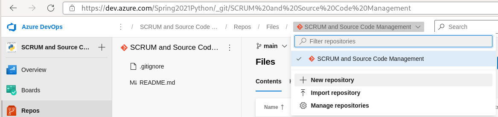
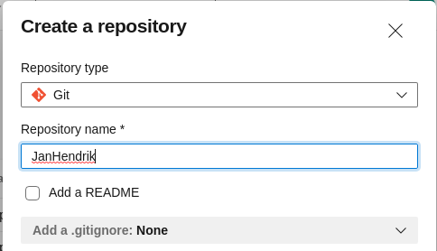
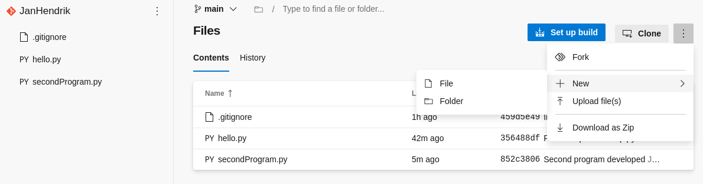
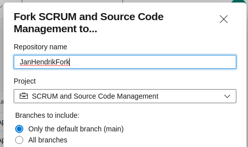

# Source Code Collaboration with git

**Further reading: The excellent [Git tutorial](https://www.atlassian.com/git/tutorials) by Atlassian**

## Installation

Head on over to <https://git-scm.org>!

### Linux

- Probably already installed ;)
- If not, use package management tool of your distro
  - `sudo dnf install git`
  - `sudo apt install git`
  - `sudo zypper install git`

### Windows

https://git-scm.com/download/windows

1. Download installer
1. Run installer (double-clicking it)
1. Refer to this [readme](./installwindows/readme.md) for necessary options

### MacOs

[Follow instructions](https://git-scm.com/download/mac)

## Working locally

We'll start locally first, so open a command line of your choice!

### Config

Before beginning, you can start by configuring the very basic settings: Username and Email address.

```code
git config --global user.name "Your Name"
git config --global user.email "YourMail@community-redischool.org"
```

These settings are important - every bit of code you add in a so-called commit will
carry this information.

Depending on the visibility of the repository, this might be public.

### Init

To see the following steps done in Visual Studio Code instead of the command line,
check out [this overview](vscode/readme.md)

With name and email set we can create our empty repository. A repository contains
your code and contains your full history of changes. It can be stored decentralized
when you work with multiple developers (or if you want that extra bit of security).

Navigate to a suitable folder or create a new one, and then use the init command.

- On Windows, you can use PowerShell (Press Windows-Key and R at the same time, type PowerShell, hit enter)
```powershell
# New-Item cmdlet creates all kinds of items.
# -ItemType Directory -> It's a folder!
# Join-Path: Glue path segments together to a valid file system path
# -Force: Create folder tree if it does not exist
New-Item (Join-Path $env:HOME 'repos\MyFirstRepository') -ItemType Directory -Force
cd (Join-Path $env:HOME 'repos\MyFirstRepository')
```
- On Linux, you can use bash or any other shell you have installed.
```bash
# mkdir: Create directories
# -p : Create folder structure
mkdir -p ~/repos/myfirstrepository
cd ~/repos/myfirstrepository
```

The rest of the commands are the same, regardless of the operating system.
```bash
git init
```

You should see output similar to:
```output
Initialized empty Git repository in /home/jhp/repos/myfirstrepository/.git/
```

Any file you create in this directory from now on can be tracked for changes
by git. Be careful never to delete the hidden directory `.git` as it contains
all data relevant to your repository. History, blobs (disassembled files) and
more. We refer to this as the working copy.

### Add

It takes two separate steps to include an item in our repository, `git add` and `git commit`.
The first command, `git add`, adds your modified files to the repository. You
can see at any time if there are files to be added by executing:

```bash
git status
```

At this time it should show "No commits yet". So let's create some Python code
in this directory! Feel free to add more complicated code than that ;)

```bash
echo "print('hello')" > hello.py
git status
```

The `git status` command now shows untracked changes. Git does not yet keep track
of their contents. Let's change that.

```bash
git add hello.py
git status
```

After adding the file, it is moved to a staging area. This staging area is used
to prepare your commit. You can always unstage files or amend them until they are
actually committed.

In bigger projects there will often be additional files. The most common one
is a hidden file called `.gitignore`. This file is used to collect all exclusions
from source control either via their relative path or using patterns.

```bash
echo "thumbs.db" > .gitignore
echo ".DS_Store" >> .gitignore
git add .gitignore
echo "test" > .DS_Store
git status
```

You can notice in the output now that the file `.DS_Store` does not appear - it is ignored.

### Commit

Commits are snapshots of the repository at one point in time. Each commit is
hashed with a cryptograpic SHA checksum. These hashes are significant
when e.g. reverting changes or merging changes by other developers.

Each commit needs to have a message. This message should contain information
to other developers indicating what the commit contains. In bigger projects
there might be a predefined structure for your commit message.

Once an item is committed, it is tracked for changes. Changes to that item can
now be committed separately. Under the hood these commits are stored in the hidden
`.git` folder.

```bash
git commit -m "Initial commit"
git status
```

If you now start to make changes to your tracked files, they will show
up as modified and need to go through the same `add` and `commit` steps!

```bash
echo "print('good bye')" > hello.py
git status
```

Any modern code editor can highlight these changes, but you can always use
`git diff` on your files as well. In practice developers tend to use graphical
tools for that. However, knowing the commands helps you in a pinch!

```bash
git diff hello.py

git add hello.py
git commit -m "Updated hello.py"
```

### Revert, Reset, Clean

Now that we have some untracked changes, we notice that they are
probably not ready for production. This is where commands like `clean`, `revert` and
ultimately `reset` come in handy.

The `clean` command can be used to clean your working directory of untracked changes. If you followed
along until now, your workspace should be clean of untracked changes when executing `git status`.

Example:
```bash
echo "Untracked" > untracked.file
git clean -n # Display what would be done
git clean -f # And do it. -f means: Force
```

The `reset` command can be used if you want to reset your current working directory, for example
to discard changes to it. This does not refer to untracked files however.

Just executing `git reset` will unstage your staged changes. Pay close attention to each
execution of `git status`.

```bash
git add hello.py
git status # File staged
git reset
git status # file unstaged
```

The parameter `--hard` indicates a hard reset - a dangerous option. Initiating a hard reset
resets your working tree as well as your staging index tree. Using this option, you will potentially
lose more data than intended.

Lastly, `git revert` can be used to revert a certain commit. That is, all changes of
one single commit will be undone and the resulting code will be added to the
working directory again. This command does not undo a range of commits, and
it will certainly require a bit of work to properly integrate the undone changes.

To find a commit to revert, take a look at `git log` first. To make the output a bit easier to
read, try `git log --oneline`. You should see two commits, referenced by their
shortened hash. The first commit should also contain the HEAD pointer. This pointer is moved
with each commit and points to the leaf - the last object in a branch or tree.

```output
c61bb36 (HEAD -> main) Updated hello.py
459d5e4 Initial commit
```

You can always refer to a commit by its hash, or you can use the HEAD pointer and count backwards.
In our case, we want to undo the last commit. So, lets revert it:

```bash
git revert HEAD --no-commit
git status
cat hello.py
```

`git revert` without `-n` or `--no-commit` will immediately create a commit. However, if you
want to examine the changes first, you can do so as well.

## Collaborating

The real strength of git is collaboration. Your repository can be shared among many developers
and each one can have their own local copy. Changes from all developers can then
be integrated into the source repository.

Usually, a repository is hosted by either a SaaS service like GitHub, Azure DevOps, Gitlab, Bitbucket or
is self-hosted with one of those products, or even as a bare repository over the network. The
technology that is used does not matter - what matters is that you are able to use it to your
advantage.

We will be using Azure DevOps, since your ReDI school accounts already have access and
you will not need to sign up for anything. If you already have a GitHub account, you can
also follow along using GitHub!

### Create Remote and Set Origin

The first step to publish our code so that other developers can work with it is to
create a remote repository that will contain our code. Working offline is done
with the local copy and changes can be synchronised whenever there is a connection.

To create your first repository, head on over to <https://dev.azure.com/Spring2021Python>
and log-in to your ReDI-Account `@communityredi-school.org`. After logging in, you
should already see an Organization called `Spring2021Python` and the team project
called `SCRUM and Source Code Management`.

Open the project and on the left-hand side select `Repos`. We will not be going into
details of the platform yet. After logging in, you can also use [this direct link](https://dev.azure.com/Spring2021Python/_git/SCRUM%20and%20Source%20Code%20Management).

To create a new repository, click on the fly-out menu at the top and select `New Repository`.
In the next window, please select a name for your repository. In this classroom setting,
please use your name without special characters as the repository name. Please deselect
the checkbox next to `Add a README` - we already have code.




The next piece of information we need appears right away: The HTTPS and SSH URIs. On Windows
you will often just use HTTPS. If you switch platforms occasionally, generating an SSH key
pair might be a better fit.

For the time being, just copy the code you can see in the middle section to your terminal.
It should look like this:

```bash
git remote add origin https://Jan-Hendrik.Peters@dev.azure.com/Spring2021Python/SCRUM%20and%20Source%20Code%20Management/_git/JanHendrik
git push -u origin --all
```

If you now execute `git remote -v` you should see your newly added remote code destination.

### Push

To publish code, we use the `push` command. This command publishes commits and branches
to our remote repository. Using the previous push, we already pushed all local branches
to our remote.

Let's quickly make some more changes and commits.

```bash
echo "print('Another file')" > secondProgram.py
git add secondProgram.py
git commit -m "Second program developed"
git push
```

When working alone, this rarely leads to issues. When collaborating with multiple developers however
we need to make sure that our local copy is up to date before
just pushing our changes.

### Pull, Pull Request

To integrate work from other developers, we often use the `pull` command. This command
can be used across multiple remote sources which makes it very versatile. For the
time being, we will use it with our own repository though.

When using source code management like git, we often pull before pushing. This means
integrating changes from colleagues first, and then adding our own changes.

To do this, we need some changes in our remote repository as well. So switch back
to your browser, and go to your new repository. Click on the three dots and
select `New -> File`. Add some content and save it. Notice that it says
`Commit` instead of save here.



Once you committed your file, your local copy and your remote copy have diverged. This
means that additional local commits will not get pushed if you have not
pulled all outstanding changes first.

Let's try it first like it always happens in the real world:

```bash
echo "print('Another file')" > thirdProgram.py
git add thirdProgram.py
git commit -m "Third program developed"
git push
```

The output should scream `rejected` and will probably look like this:

```output
 ! [rejected]        main -> main (fetch first)
error: failed to push some refs to 'https://dev.azure.com/Spring2021Python/SCRUM%20and%20Source%20Code%20Management/_git/JanHendrik'
hint: Updates were rejected because the remote contains work that you do
hint: not have locally. This is usually caused by another repository pushing
hint: to the same ref. You may want to first integrate the remote changes
hint: (e.g., 'git pull ...') before pushing again.
hint: See the 'Note about fast-forwards' in 'git push --help' for details.
```

The proper way to solve this would be to fetch outstanding changes first. This
would indicate if your local and remote copies indeed diverge. After fetching, we
can then pull the changes and push our local commit.

```bash
git fetch
```

The output should show you that local and remote repository HEAD pointers are
pointing to different commit hashes.

```bash
852c380..2d733ce  main       -> origin/main
```

After pulling, your local repository will be ahead of the remote.

```bash
git pull
git status
```

Now your changes can be pushed back to the remote:

```bash
git push
```

### Branch and Merge

A branch is a literal branch branching off the working directory tree.
At some point, branches might "grow back" or get merged back into the
tree. Every git repository comes with one initial branch when it is created.

In our case, the initial branch was called main. Developers can then decide
to create topical branches to work on that don't immediately affect
the main productive code.

To create a topical branch e.g. to add a new feature to your program, you can
use `git branch` and `git switch`. This is not the only way, but it
is a bit more readable for beginners.

```bash
git branch newtool
git switch newtool
git status # On branch newtool
echo "print('Another tool!')" > fourthProgram.py
git add fourthProgram.py
git commit -m "added another tool"
```

Now to push the branch, we need to track it and set an upstream
branch. This can be done with `push` as well.

```bash
git push -u origin newtool
```

If the time has come to integrate your new feature into the production
branch (in our case called `main`) we `merge`. To do this, we first switch
to the branch to merge changes into, in our case main. Then we tell git
which branch to merge.

```bash
git switch main
git merge newtool
git push
```

Unused branches should ideally be cleaned up. Otherwise you might get confused.
We can use the `branch` and `push` commands to do just that.

```bash
git branch -d newtool # delete unused branch
git push -d origin newtool # push deletion to remove branch on remote as well
```

### The real world

In the real world, things are often a bit more complicated. These two hours
should have given you a little insight into git though.

In software development projects developers work with branches and forks.
The main repository - depending on the workflow - is used to integrate
changes from developers. After changes to the main repository occur, tests
are being executed, packages are built and published and so on.

Not all projects will work with branching or forks. Some teams just use
the main branch and have all developers contribute to it. Others use
complicated workflows including branching models and pull requests.

Since many open source projects are indeed using forks, branches and pull
requests, we will try this as well.

A fork is a copy of the entire repository that the developer then owns.
Work in this fork is done without any other developer being affected
by this.



Lastly, a pull request is just a mechanism to let a repository owner
or maintainer know that you have some code you would like to add
to their repository.

## Homework

- Create a fork of the [main repository](https://dev.azure.com/Spring2021Python/SCRUM%20and%20Source%20Code%20Management/_git/SCRUM%20and%20Source%20Code%20Management)
- Clone the fork **locally** in your IDE or on the command line
- Add some changes, for example the Python code you created during previous lessons
- Commit those changes and push them to **your** repository
- Create a pull request targeting the repository `SCRUM and Source Code Management`
- Wait for your teacher to review and merge the pull request ;)
