Feel free to refer to this little click-through for a typical git setup on Windows.

- Accept License  
    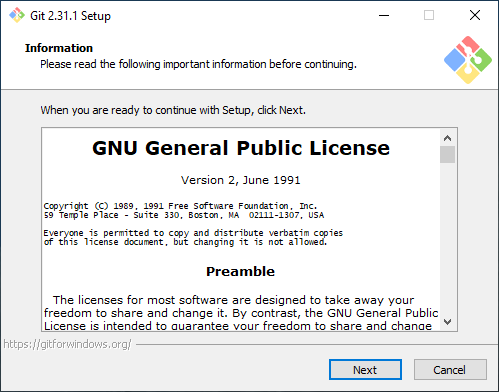
- Keep default location  
    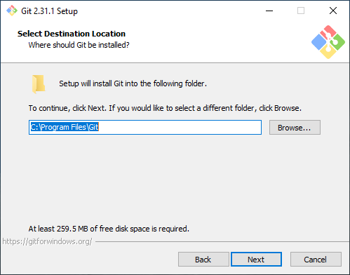
- Apply selection  
  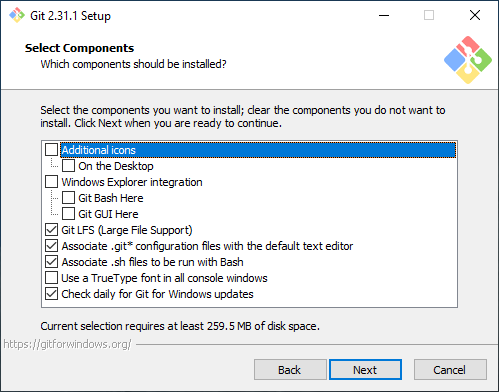
- Choose the start menu folder to create  
  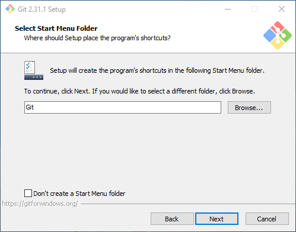
- Select an appropriate editor ***that you are comfortable with!***  
  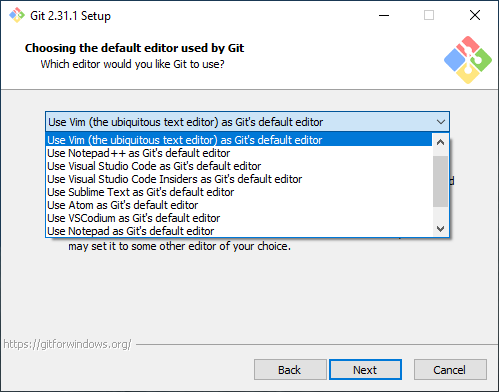
- Select a default branch name. `main` is the new default and perfectly fine  
  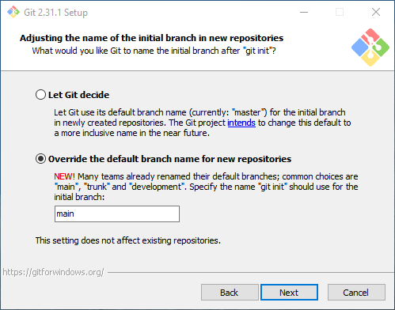
- Select middle option on Windows  
  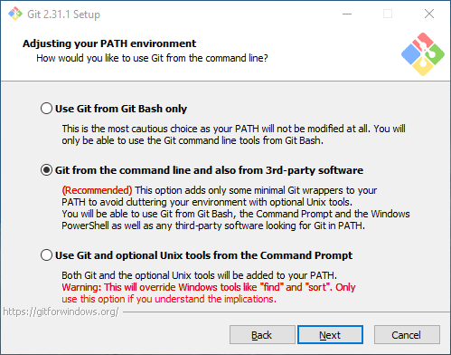
- Select OpenSSH  
  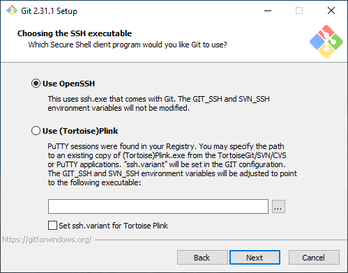
- Select Windows SChannel, unless you don't plan on working in a corporate environment  
  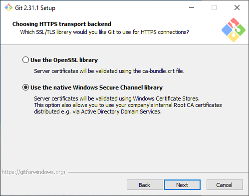
- Leave default  
  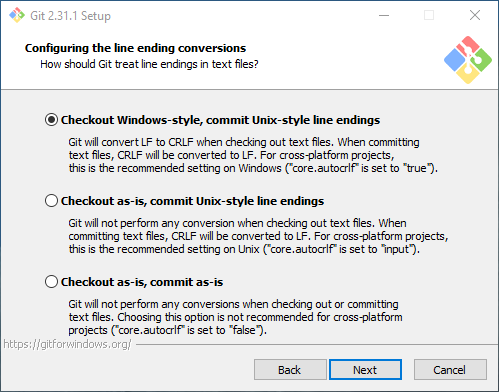
- Leave default  
  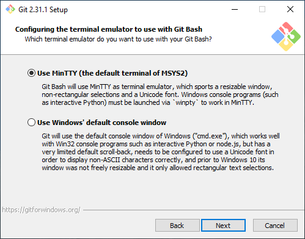
- Either default or rebase  
  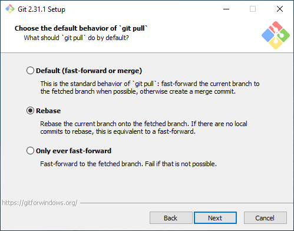
- Select Credential Manager Core  
  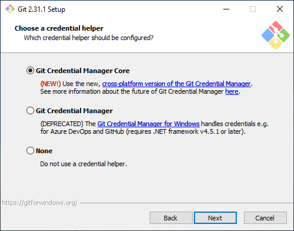
- Caching is fine, symlinks usually not necessary  
  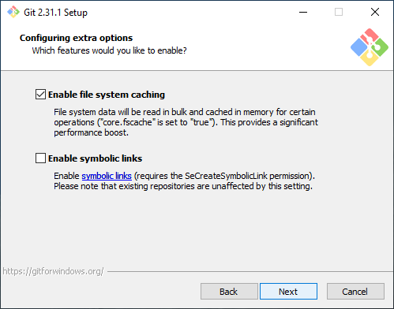
- No experimental stuff  
  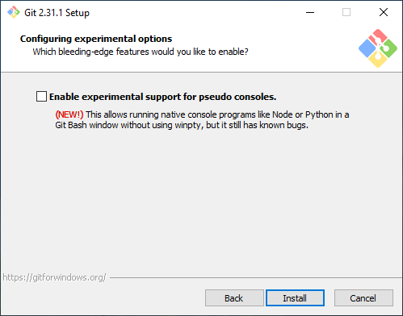