# Interacting with git in Visual Studio Code

## Initialize a new repository

First of all, open the directory you want to use as your new repository. Create a new directory if necessary.

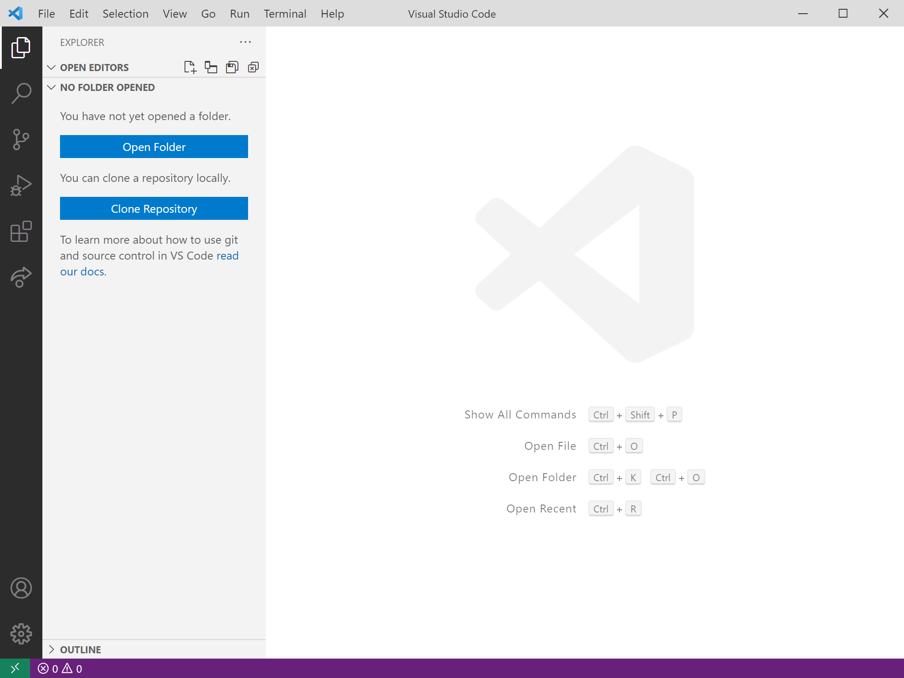
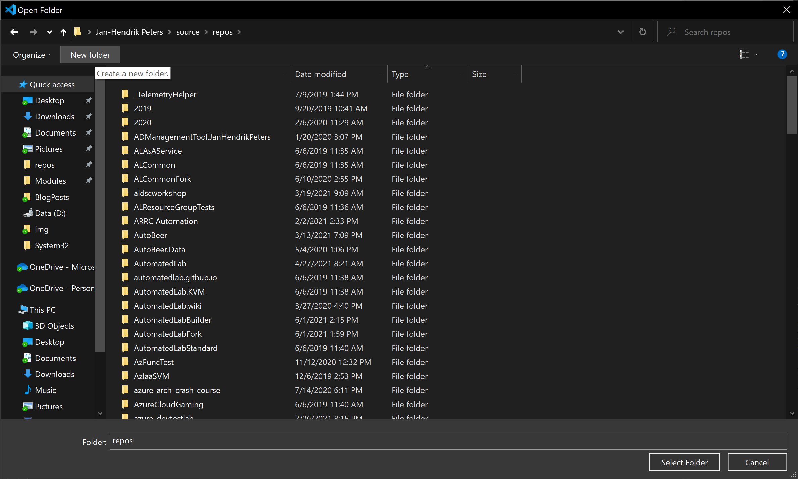

After the directory has been openend in VS Code, open the Source Control tab on the left side. Click on the button `Initialize Repository` to initialize your new repository. This is the same as typing `git init` on the command line.

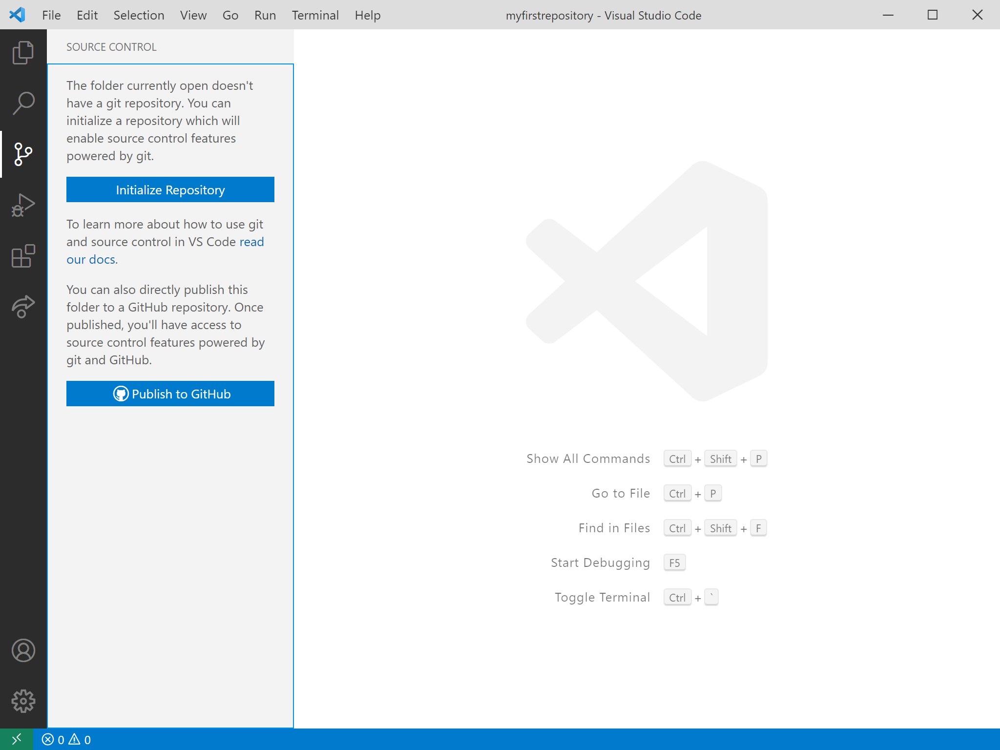

## Add

Use the Explorer tab on the left side to create a new file called hello.py.

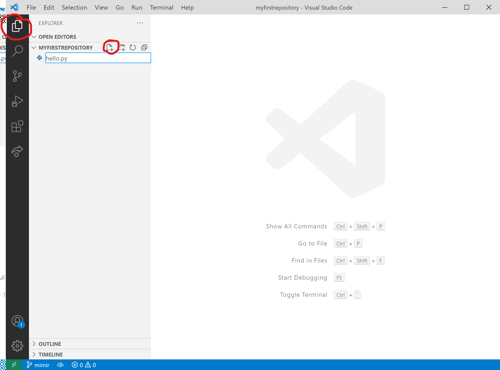

You can also use your own Python code to follow along, of course. If you don't have anything yet, add a print statement to the file `print('hello world')`.

If you open the Source Control tab again, you can see that there is a new, untracked file. The icons right next to the file, from left to right, mean: Open File for editing, Discard changes, Add file to staging area.

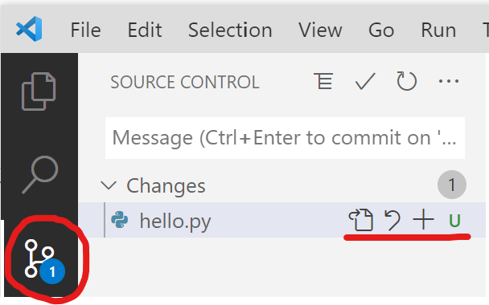

If you click on the `+` icon, the file is added to the staging area. This is the same as typing `git add hello.py` on the command line.

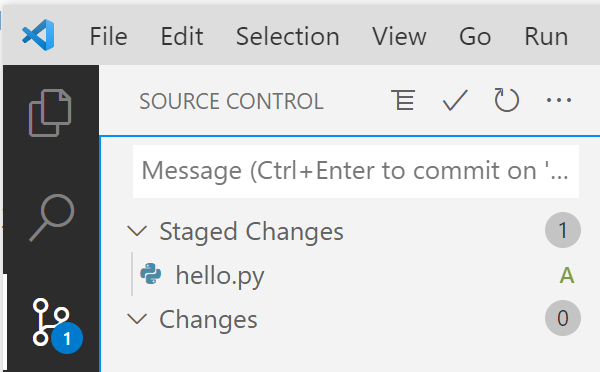

After it has been staged, it can be commited from the Source Control tab.

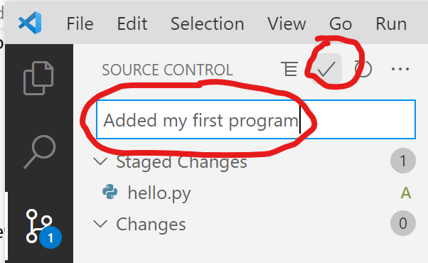

Be sure to use a good commit message! This is the same as typing `git commit -m "What have I done?"` on the command line.

Repeat the steps to add and commit a new file called `.gitignore` to see how the exclusion list works.

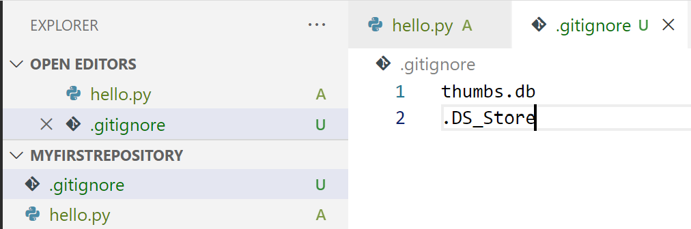

After the commits are done, the Source Control tab should be empty. Change the contents of hello.py and save them to see how tracked files behave.

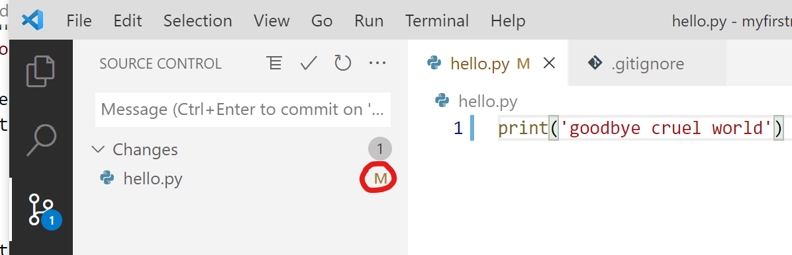

The file appears with the letter `M` next to it, indicating that it has been modified. Notice the difference to the untracked files denoted by the letter `U`. If you now click on the file in Source Control, you can immediately see the differences.

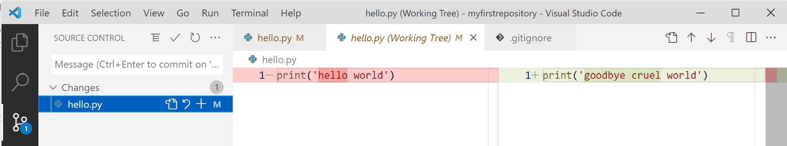

The left side of this graphical diff is read-only, whereas the right side can still be edited as long as the file is not yet staged.

Stage the modifications again using the `+` sign and commit them.

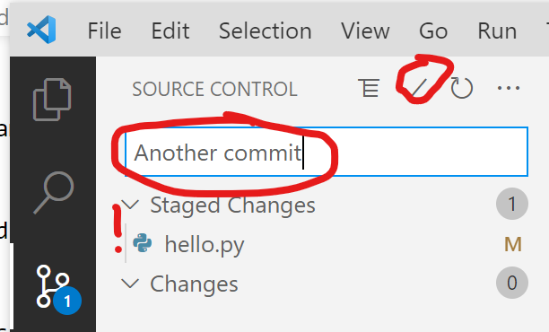

## Revert, Reset, Clean

Cleaning your workspace of untracked changes can be done from Source Control as well. Create a new file, go to Source Control and click on the round arrow button next to the file. For untracked files, it will bring up a warning dialog.

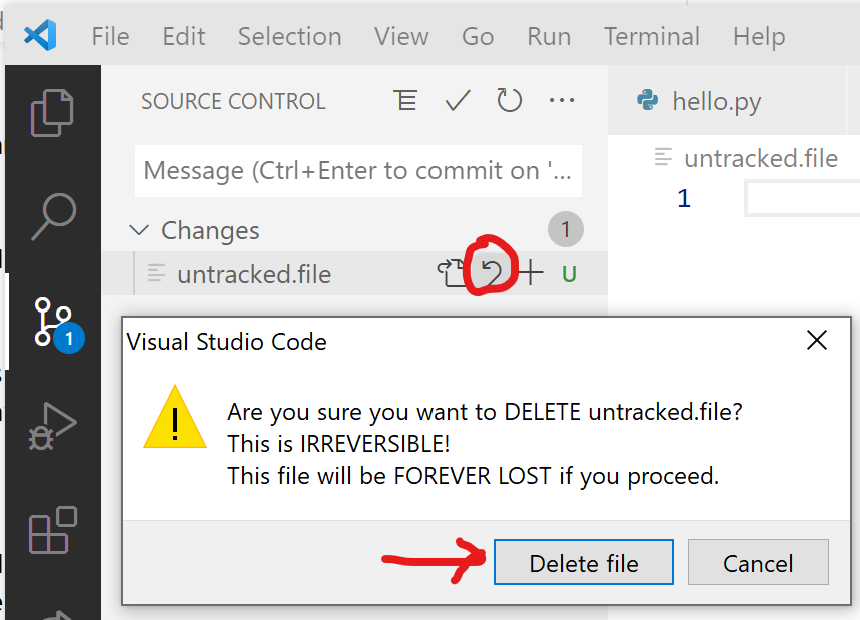

This is similar to `git clean -f`.

To use the reset command, you can use the same button or buttons. Modify the contents of your `hello.py` and `.gitignore files.`. This time, to discard all changes, use the arrow button on top of all staged changes.

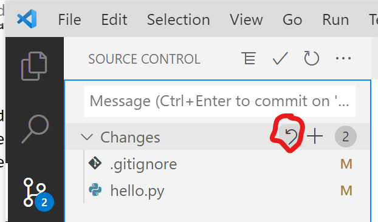

This is similar to `git reset` on the command line.

Reverting a commit is only possible for the latest commit. To revert other changes, you have to use the command line. To revert the last commit, open the kebap menu `•••`, go to `Commit` and then click on `Undo last commit`.

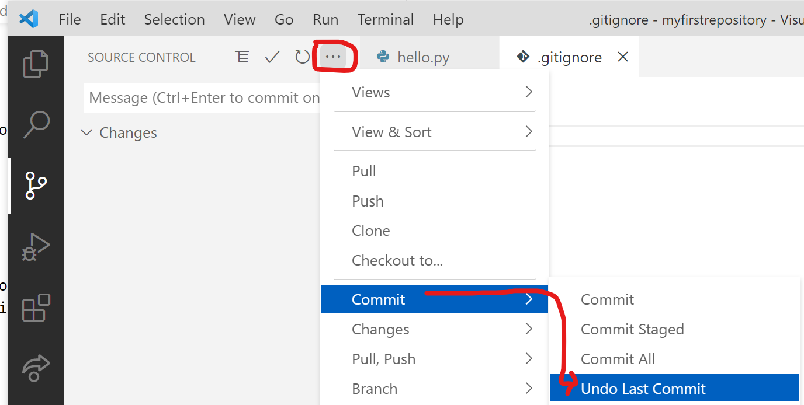
